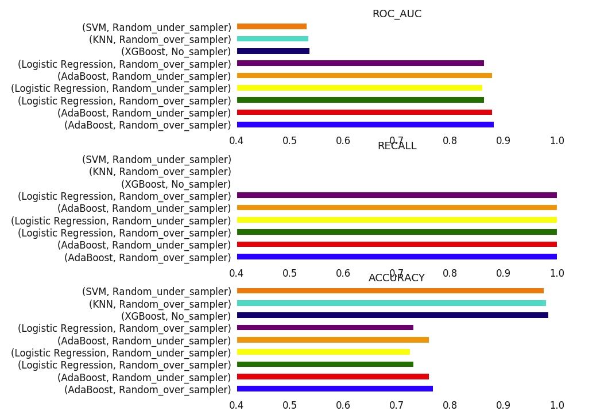

<h1 align=center> Prédire l’évolution du pandémie COVID 19 par les symptômes préliminaires diagnostics </h1>

Dans le cadre de ce rapport et en présence de données disponible, nous avons identifié ces problématiques : 
- 	Identifier les données de santé permettant de caractériser un patient à partir de symptômes. 

- A partir de données extraites du Kaggle, l’implémentation de ces algorithmes de machine Learning capables d’apprendre à partir de données et de détecter les patients atteints du COVID 19 ou pas. 

- En se basant sur de données de London Collège, le dataset contient de patients atteints du COVID 19, à partir de ces symptômes, nous avons créé une target de patients décédés ou non pour déterminer la probabilité pour un patient qu’il soit décédé. 

<h2 align=center>Données :</h2>

•	Imperial College London: les données de patients incluant les symptômes ONSET, date, hospitalisation(df_dummy2). 

-	 https://www.imperial.ac.uk/media/imperial-college/medicine/sph/ide/gida-fellowships/ 
-	 https://www.imperial.ac.uk/media/imperial-college/medicine/sph/ide/gida-fellowships/subset_international_cases_2020_03_11.csv
-	https://brunods10.s3-us-west-2.amazonaws.com/MIT_COVID/latestdata.csv

•	Diagnosis of COVID -19 and its clinician spectrum (covid_einstein). 
-	 https://www.kaggle.com/einsteindata4u/covid19

<h3 align=center>Modélisation :</h3>

<h4 align=center>Evaluation :</h4>

<h5>Author: </h5>

Younes BENOUALY  
